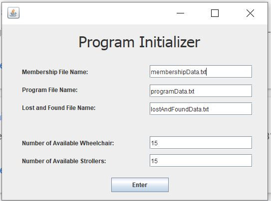
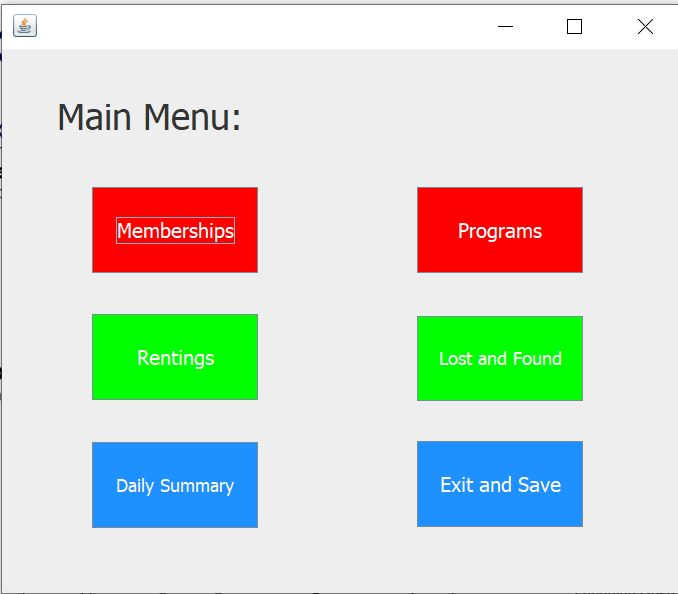
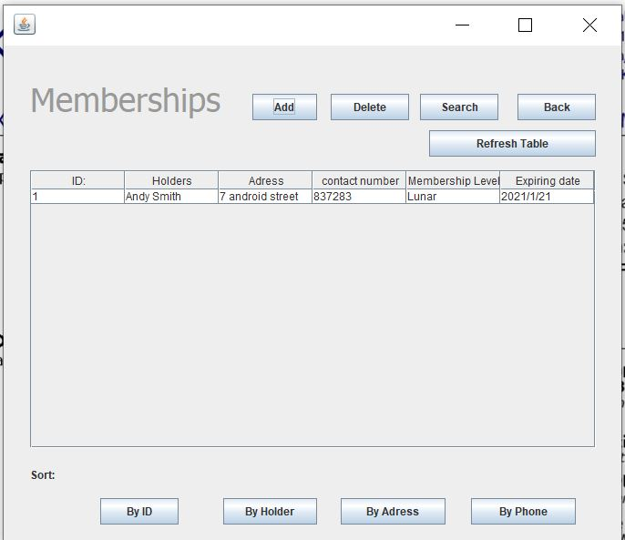
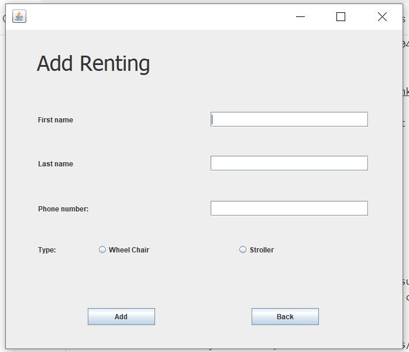

# Science Centre Membership in Java
PURPOSE OF PROJECT: Allow user to access, modify, and manage members of the Science Centre.

VERSION or DATE: 2018-03-17

AUTHOR: Kai Yuan Chi

HOW TO START THIS PROJECT: Find runnable201803111046.Jar file and run, please enter valid input for items or click enter on the program initialize page

To see a program demonstration, checkout this [link to video demo](https://www.youtube.com/watch?v=8pAowg0_gQU) on youtube 

To see a detailed UI explaination, please checkout **file Membership_Management_UI.pdf**
 
USER INSTRUCTIONS: 
The program has the following functions: 
* Count the number of visitors and print a daily summary. 
* Access/modify members’ information. Each member can be searched up by name, membership code, or address. 
* Add/remove a member
* Access to a list of daily programs.
* Sort members by last name, first name. 6. Access/modify available wheelchairs/strollers and borrower’s information.
* Access, modify, search, and add lost and found items information within the past 30 days.
* Import/export members information from/to a file for backup.
* Include access restrictions to modifications. 
* Operate with a graphical user interface.

Here are some screenshots of the program: 

